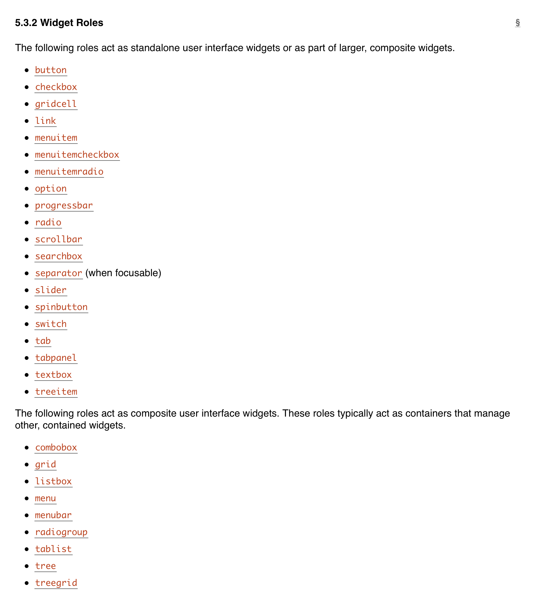

## Behavior and markup > implementation details

## Roles > Tag Names

You can find a list of roles here [in the spec](https://www.w3.org/TR/wai-aria/#widget_roles).

## Roles > Test IDs

- Test IDs are fragile. They are not part of behaviour.
- Easier to write tests first.
- Reduce coupling to a certain implementation.
- Can swap out third-party components.
- Good accessibility from day one.

## Use accessible names

<table style="width: 100%; text-align: left;">
  <thead>
    <tr>
      <th>Role name</th>
      <th>Responsibility</th>
      <th>HTML example</th>
    </tr>
  </thead>
  <tbody>
    <tr>
      <td>Button</td>
      <td>Perform action here</td>
      <td>`<button>`</td>
    </tr>
  </tbody>
</table>

## Reduce coupling to specific implementations

- Reach UI or React Modal?
- React Select or Downshift?
- Emotion or CSS Modules?
- React or Vue?
- HTML and ARIA are stable, consistent specifications
- Third-party libraries are unstable, discrepant implementations

## Specs

- <https://www.w3.org/TR/wai-aria-practices/>
- <https://www.w3.org/TR/html-aria/>
